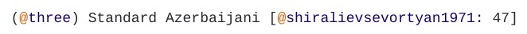

---
title: "Writing a chapter"
output:
  html_document:
    fig_cap: yes
    highlight: tango
    smooth_scroll: no
    theme: cosmo
    toc: yes
    toc_float: yes
---

```{r setup, include=FALSE}
knitr::opts_chunk$set(echo = TRUE)
```

Each feature dataset is accompanied by an introductory chapter. You can browse the [Atlas]() for some examples. 

Texts should ultimately be prepared in `Rmarkdown`. Feel free to write a draft in .doc format first if you find that more convenient, but keep in mind that you will have to convert it to .rmd later.


# Structure of the text

Below is a list of recommended sections and points to address in the text.

### Introduction
- Briefly explains what the feature is
- Gives a general characterization of how it is expressed in East Caucasian 
- Gives a general characterization of how it is expressed cross-linguistically
- If applicable: describes how the classification in [TALD](https://timtim1342.github.io/index.html) differs from [WALS](http://wals.info) (e.g. our chapter on the [Standard of Comparison](https://timtim1342.github.io/standard_of_comparison.html) shows more sub-types of spatial comparatives)
- Describes the goal of the text / map in one sentence: "Our goal is to classify the languages of Daghestan according to the type of spatial form used to mark the standard of comparison."

### Results
- Summarizes the different types/values you discovered; types identified in the text should correspond to values shown on the map. If you want to fuse multiple types into one category, be sure to explain this decision in the text. 

>**A hypothetical example:**  
[Comparative constructions]() are usually based on spatial case forms, which consist of a localization and a directionality. Let's say Chiara only cares about directionality, because differences in localization occur more rarely and do not show an interesting distribution. She can choose to create general categories based on directionality (e.g. essive and elative), and mention in her text that elative includes both super-elative and cont-elative forms.

- Provide examples
- Identify which types are more and less common

### Distribution
- Does the distribution of different types show a genealogical and / or areal signal?

# Literature references

In-text references to literature use the following syntax:

`[@forker2018: 100]`

> (Forker 2018: 100)

Placing parantheses around the year and page only:

`According to Forker [-@forker2018: 100]`

> According to Forker (2018: 100)

References are cited using a `Bibtexkey`, same as in the [feature datasets]().

For the Chapter, you will have to compile your own list of references in [bibtex](https://en.wikipedia.org/wiki/BibTeX) format:

1. Create a plain text document in a basic text editor like Notepad and name it `bib.tex`.
2. Enter your references in bibtex format (see some examples [here](https://www.bibtex.com/e/entry-types/)). *Note that you do **not** have to add these references to the literature database or the archive.*
3. Upload this file along with the text of your chapter in .rmd format to your feature's folder in the [archive](https://drive.google.com/drive/folders/1Rrm0NOH2E7dGMC97TdCFhjg7Y_FrAU3i?usp=sharing).
4. Send a message to Chiara and Samira that you uploaded your material


# Formatting

To create subheadings, lists, bold or italic text, see a [quick guide](https://www.markdownguide.org/basic-syntax) on Rmarkdown syntax.

See Section [Literature references](#literature-references) above on how to cite sources in Rmarkdown.

## Examples

Examples should contain the number of the example in the text, followed by the name of the language and a reference to the source:



Add glosses to the example using regular CAPS, everything else will be formatted automatically.


